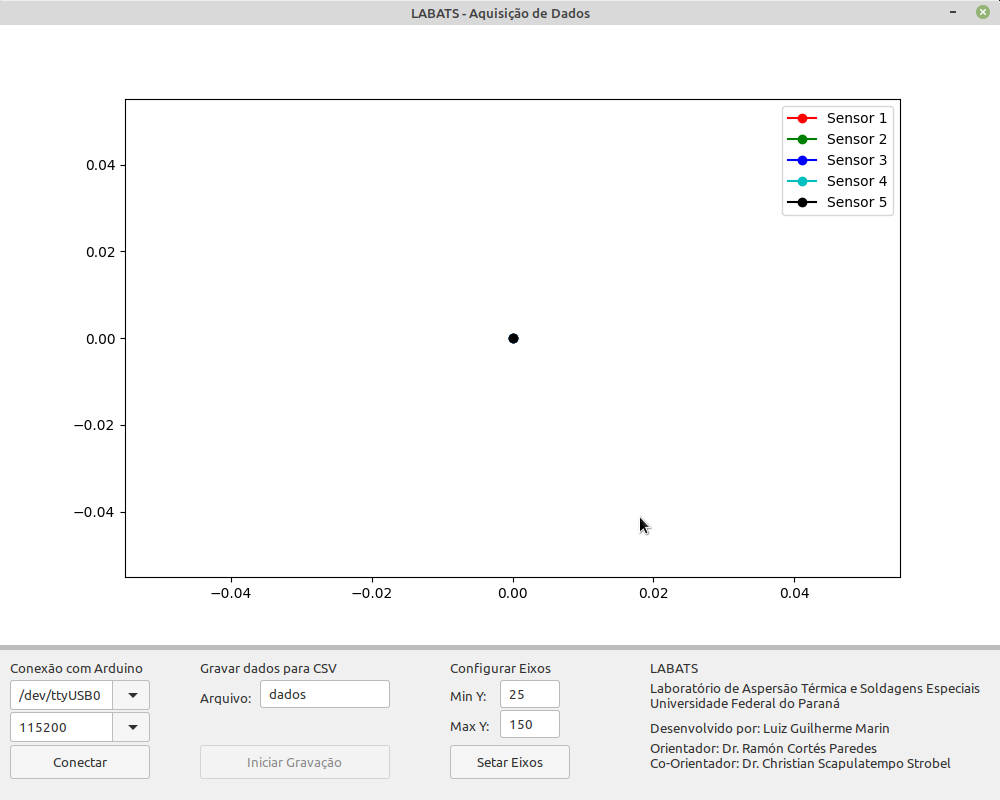

# Arduino Data Acquisition

## _Data Acquisition Software based in Arduino_

[](https://img.shields.io/badge/Code-Python-informational?style=flat&logo=python&logoColor=white&color=blue)
[](https://www.python.org/downloads/release/python-3100/)

This software was developed as part of my Masters in Mechanical Engineering project. I was in need of a reliable way of measuring temperature in different points.

The hardware allows for 5 different data points, collected by 5 MAX6675 Digital Converters.



## Objectives

Development of a simple UI tha allows reading the temperature on the fly and generate a CSV file with all data:

* Development of a Python based UI using wxPython module
* Allow for real time tracking of data
* Allow for generation of CSV report

## Dependencies

matplotlib, pyserial and wxPython

```sh
pip install -U matplotlib pyserial wxPython
```
